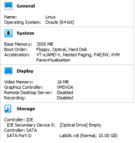
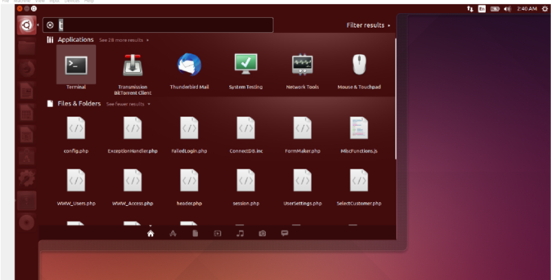
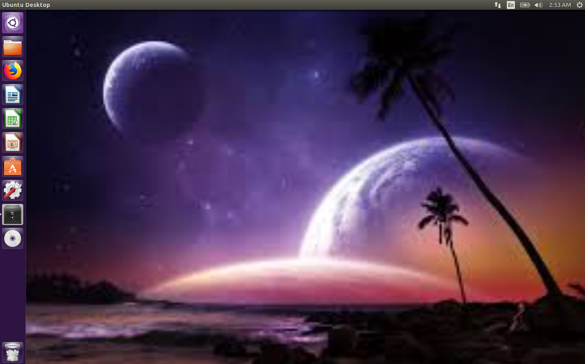

## Lab 06

- Name:Christian Wilbourn
- Email:cwilbourn.2@wright.edu

## Part 1 Answers

1. Steps to configure virtual hardware:
To create a new virtual machine on Virtual Box I selected "new" to create a new virtual machine.
Next, I typed in the name of my virtual machine and selected Linux to be my type and Other Linux (64-bit) to be my version.
From there I changed my RAM to 2GB and proceeded to set my virtual machine to have 10 GB of disk space.
2. 
3. Steps to download an iso:
To download the Ubuntu iso I went onto their site and downloaded the latest version to get ready to install it into my virtual machine.
4. Steps to use iso on VM:
To use my Ubuntu iso on my virtual machine I went to settings and clicked on storage. From there I proceed to add the disk file that I downloaded on to the my virtual machine adding the iso.
5. Steps to install your distribution:
6. To install Ubuntu I hit the install Ubuntu button after making it my start-up disk. From there I clicked erase disk and install Ubuntu. Then proceed ot fill out the rest of information to finish the installation.
7 Steps to boot to disk after install: After installation is finish I restarted my virutal machine and was able to boot the disk successfully.
8. Steps to install "Guest Additions" & enable fullscreen mode:
To install "Guest Additions" I went to the devices tab while my virtual machine was going and clicked "Insert Guest Additions CD image" from there I clicked run and proceed to type these two commands "sudo apt install build-essential dkms linux-headers-generic" amd "sudo rcvboxadd setup"
To enable fullscreen mode in virtual machine you can go to the view table and select full screen mode or use the Host F function.
12.

## Part 2 Answers

1. To change my desktop background on my virtual machine I went onto Firefox searched for nature backgrounds and once I found a background I liked I right clicked and set that photo as my desktop background.

2. Using Firefox on my virtual machine I typed and went to espn.com
3. To install VSCode I searched for it on Firefox and proceeded to download on to my virtual machine.
4. To connect to AWS with my virtual machine I had to vim and create a file for the ceg2350 private key onto my virtual machine. Then change the permissions using "Chmod 600 ceg2350-key.pem". From there I was able to ssh using "ssh -i ceg2350-key.pem ubuntu@54.226.111.65" where I connected to my AWS instance.
