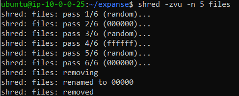

## Lab 07

- Name:Christian Wilbourn
- Email:wilbourn.2@wright.edu

## Part 1 Answers

1. /dev/xvda is currently the mounted device. I used the prompted "df -h" to find it.
2. Yes there is another drive in /dev called udev. 
3. `gdisk` main menu options
   - `p` Is to print out the partition table.
   - `o` Is to create a new empty DOS partition table
   - `n` Is to add a new partition
   - `i` Is to print information about a partition
   - `w` Is to write a table to a disk and exit
4. Using the `gdisk` utility on the disk: I used the commmand "sudo gdisk /dev/xvdb". Next, I used the command "n" to create a new table. Then placed the partiion number and set the sectors and then I had the partion type as a "Linux Filesystem".
5. sudo mkfs.ext4 /dev/xvdb1
6. sudo mkdir /mnt/expanse
7. sudo mount -t ext4 /dev/xvdb1 /home/ubuntu/expanse
8. Skip - trust you to do it ;)
9. "sudo strings /dev/xvdb1" It is outputing existing data in the file that were referred back and printed.
10. Even though I deleted a file of mine when I ran the command "sudo strings /dev/xvdb1" the output of the deleted file still showed.
11. To truly delete the file I used the shred commnand. In using the shred command I wrote "shred -zvu -n 5 file" this immediately removed file. I did confirmed be going back and running "sudo strings .dev/xvdb1"
Proof file is no longer reedable:

12. After unmounting the data I cannot interact with the files and folders anymore. Command used "sudo umount /dev/xvdb1"

## Part 2 Answers

1. The original.txt file is there with a couple of sentences.
2. For `original.txt` identify:
   - Command to find the following info about `original.txt`: "stat original.txt"
   - inode number of `original.txt`:
   - number of blocks storing `original.txt`: 
   - number of links to `original.txt`:"
3. Command to create a hard link to `original.txt`: "ln original.txt original2.txt"
   - What identifiers indicate a hard link was created? "ln" is used to link file. As well using the "stat original.txt" I can see that the links went from 1 to 2.
   - Does modifying the hard linked file modify `original.txt`? Explain: Yes, because in a hard link file any changes that are made in the new file original2.txt will happen to the original.txt
4. Command to create a symbolic link to `original.txt`: "ln -s original.txt symbolic_original.txt"
   - What identifiers indicate a symbolic link was created?  What identifys a symbolic link is using "ln -s" as this used specifically for sumbolic links. Also when using the commnad "Ls -li symbolic_original.txt" it shows up there as well.
   - If `original.txt` was deleted, and a new `original.txt` was created, would the sym link still work? Explain:  No the sym link would not work as delted the "original.txt" would break the symbolic link and whatever data in the file would be gone.
5. Command to create a copy of `original.txt`: "cp original.txt original_copy.txt
   - Does modifying the copied file modify `original.txt`? Explain:  Modfying the copied file does not modify "original.txt as when you copy it just makes a separate file that are not linked together. So if changes occur in the file you copied it will not show up in the original.
6. Command to move `original.txt` to another directory. "mv original.txt new_dir"
   - Does it have the same inode? Explain: Yes it does have the same inode because it is the same file and changing its location does not affect the number of inodes it has.
   - Was the hard link you created affected? Explain: No it would not be because it is still the same file so again changing the location will not affect the hard links.
   - Was the symbolic link you created affected? Explain: This would be affected as symbolic link looks for a file back at its original location. If it is not there then the symbolic file is affected.
